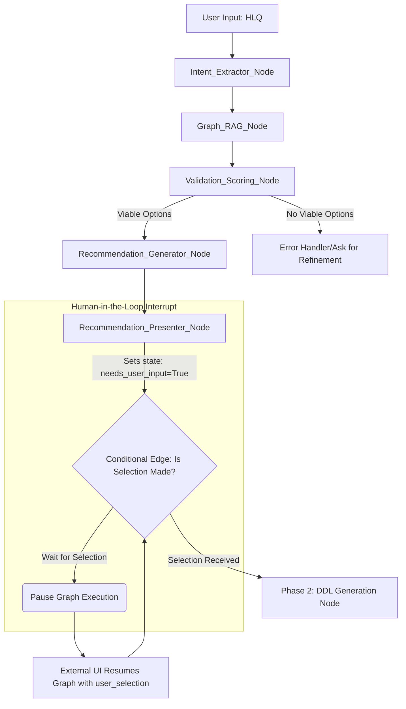

# LLM Data Recommendation Implementation Cookbook

This document consolidates all documentation for Phase 1 (Data Model Recommendation) into a single file.


---

# 1. OVERVIEW: IMPLEMENTATION GUIDE (DATA MODELING COOKBOOK)


This document is the **single source of truth** for implementing the Data Model Recommendation Engine (Phase 1). It defines the strict rules, scoring logic, and modular responsibilities required for the system to function accurately and reliably.

### A. How to Use this Cookbook

1.  **Understand the Flow (Architecture Tab):** The system is a workflow. Your code (Orchestrator) connects the Graph RAG Service (finding data) and the LLM Service (scoring/formatting).
2.  **Code the Validation Logic (Scoring & Validation Tab):** The core intelligence is the **Critical Validation Check**. Implement this function first. It's non-negotiable: if a column is missing, the option is **invalid**, regardless of score.
3.  **Construct the Prompt (LLM Prompt & Output Tab):** The LLM requires a highly structured prompt (System Instruction + User Query payload). **Do not skip the System Instruction**—it contains all the rules.
4.  **Final Output:** The final recommended data model (generated by the LLM) contains *sufficient* information (Source Tables, Join Keys, Column Mappings) for a downstream LLM to generate DDL or PySpark code **without further human intervention** (as confirmed by the DDL generation guidelines).

### B. Module Responsibilities Summary

| Module | Core Function | Rookie Focus |
| :--- | :--- | :--- |
| **Orchestrator** | Connects all services, runs Validation SUDO CODE (Section 4), sends validated options to LLM. | **State Management** and **Validation Logic** |
| **Graph RAG Service** | Executes the Cypher query (Architecture Tab) to retrieve the required JSON payload. | **Query Generation** and **JSON Formatting** |
| **LLM Service** | Runs the 50/30/20 Scoring, selects the best option, and formats the result into the specified Markdown. | **Structured Prompting** and **Response Parsing** |

**Recommendation to Developer:** Always enforce the Layer Lineage Rule (relaxed: Bronze can be used everywhere) and the Strict Grounding Rule (all fields must exist in the JSON).
                

---

# 2. ARCHITECTURE AND GRAPH RAG REQUIREMENTS (SEQUENCE DIAGRAM)


## 1. High-Level Architecture Flow Diagram (Core Recommendation Loop)

The entire process is managed by an **Orchestration Service** which ensures the strict sequencing of steps, especially the Validation Check before scoring by the LLM.

```mermaid
graph TD
    A[DE Request (HLQ)] -->|User Input| B(Orchestration Service)
    B -->|1. Generate Search Query| C[Graph RAG Service: Cypher Generation]
    C -->|2. Execute Cypher| D[Neo4j/Vector DB]
    D -->|3. Return Filtered JSON| E(Orchestration Service)
    E -->|4. Pass JSON + Prompt| F[LLM Service: Recommendation Scorer]
    F -->|5. Structured Output| G[Scored Recommendations]
    G -->|6. Present to DE| H(UI/Recommendation Presenter)
    H -->|7. DE Feedback/Confirmation| A
```

## 2. Module Specifications

This table details the responsibilities and expected outputs of each component.

| **Module** | **Responsibility** | **Output** |
| :--- | :--- | :--- |
| **A. Orchestration Service (The Reasoning Node)** | Acts as the central brain: Handles intent extraction, runs the **Pre-Scoring Validation Check (SUDO CODE)**, and compiles the final LLM prompt payload. | Validated, Scored Options |
| **B. Graph RAG Service** | Executes semantic search on the Knowledge Graph to extract only relevant tables/columns/relationships (the JSON payload). | Filtered JSON Metadata |
| **C. LLM Service (Phase 1)** | Scoring, Selection, and formatting the output into the **Recommendation Report** (Markdown). | Structured Markdown Recommendation Report |

## 3. Graph RAG Implementation Details

### Expected Output from Graph RAG

The service must return a single **Filtered JSON Metadata** object containing:
* Tables (nodes) matching keywords (e.g., 'sales', 'material').
* Columns (properties) matching required fields (e.g., VBELN, MATKL).
* Layer information (`bronze`, `silver`, `gold`).
* Relationships (joins) between those relevant tables.

### Sample Cypher Query Logic

The service translates the user query into a Cypher query to retrieve the subgraph.

```cypher
// 1. Match relevant tables and their columns based on required fields (e.g., VBELN, MATKL)
MATCH (t1:Table)-[:HAS_COLUMN]->(c1:Column)
WHERE c1.name IN ['VBELN', 'POSNR', 'MATNR', 'MATKL', 'LVORM', 'KWMENG', 'MEINS']

// 2. Find paths between relevant tables to identify join possibilities
MATCH (t1)-[r:JOIN_KEY|IS_SOURCE_OF*1..3]-(t2:Table)
WHERE t1.layer IN ['bronze', 'silver'] AND t2.layer IN ['bronze', 'silver']

// 3. Return a sub-graph structure that the LLM can analyze for combinations
RETURN t1, t2, r, c1
```
                

---

# 3. MANDATORY SCORING SYSTEM AND CRITICAL VALIDATION


The LLM acts as the scoring engine, but the **Orchestrator** must first filter options using the Validation Check.

## 4. Critical Validation Logic (MUST BE ENFORCED)

This check **OVERRULLES** the score. If a column is missing from a combination, that option is immediately rejected. The Orchestrator should implement this logic before calling the LLM.

### SUDO CODE: Pre-Scoring Validation Check (Copyable for Integration)

```python
FUNCTION Validate_Combination(combination_tables, required_columns):
    # 'combination_tables' is a list of tables in a potential join (e.g., [T1, T2])
    # 'required_columns' is the list derived from the HLQ (e.g., ['VBELN', 'MATKL', ...])

    # 1. Check if ALL required columns are present in the combined source tables.
    missing_columns = []
    for column in required_columns:
        is_found = False
        for table in combination_tables:
            # Assume table.columns is a set or list of column names for efficient lookup
            if column in table.columns: 
                is_found = True
                break
        if not is_found:
            missing_columns.append(column)

    # 2. FAIL if any column is missing.
    if len(missing_columns) > 0:
        RETURN False, f"FAILED VALIDATION: Missing critical columns: {missing_columns}"
    
    # 3. If all fields are found, the combination is viable for scoring.
    RETURN True, "VALIDATED"
```

## 5. Scoring System (LLM Responsibility)

The LLM must apply these criteria to rank every **viable** combination identified in the JSON metadata. The total score is out of 100 points.

| **Criterion** | **Weight** | **Value/Points** | **Rationale** |
| :--- | :--- | :--- | :--- |
| **1. Layer Priority** | **50%** | Silver: 50 pts, Bronze: 0 pts | Higher data maturity is paramount. |
| **2. Completeness/Directness** | **30%** | Fewest joins = 30 pts | Favor 2-table joins over 3-table joins. |
| **3. Source Type Consistency** | **20%** | Same layer sources = 20 pts | Consistent quality reduces complexity. |
| **4. Pattern Match** | **0%** | N/A | Reserved for future lineage adherence bonuses. |

## 6. Layer Lineage Rules (Relaxed Constraint)

| **Target Layer** | **Allowed Source Layers** | **Rationale** |
| :--- | :--- | :--- |
| **Silver Table Creation** | Bronze, Silver | Relaxed rule: Bronze can be a direct source for any layer. |
| **Gold Table Creation** | Bronze, Silver, Gold | Relaxed rule: Bronze can be a direct source for any layer. |
                

---

# 4. LLM PROMPTING AND MANDATED OUTPUT STRUCTURE (RECOMMENDATION REPORT)


The LLM call requires combining a strict System Instruction (rules) with a structured User Query (data) to force the desired output format and logic execution.

### A. System Instruction (The LLM's Persona and Rules)

This instruction is mandatory and non-negotiable.

```javascript
const systemPrompt = `
You are the GraphGenie Recommendation Engine. Your sole purpose is to analyze a user's data request, compare it against the provided JSON Knowledge Graph metadata, and generate a scored list of the top 3 viable source table combinations.

RULES:
1. **Scoring:** Use the provided 50/30/20 scoring criteria (Layer Priority/Completeness/Consistency) strictly.
2. **Validation:** A combination is ONLY VIABLE if ALL requested columns are found in the source tables. If a high-score combination is missing a required column, it must be marked as 'FAILED VALIDATION' and an alternative, complete option must be found.
3. **Column Grounding:** Use the EXACT column names found in the JSON (e.g., 'VBELN' instead of 'sales_doc_number') for the source column mapping.
4. **Output:** Generate the final output using the specified Markdown structure.
5. **Layer Lineage:** Bronze tables can be used as sources for any target layer (Silver or Gold).
`;
```

### B. User Query Payload (The Input Data)

The Orchestrator compiles the HLQ, the derived required columns, and the Graph RAG output into this payload.

```javascript
const userQuery = `
// --- INPUT DATA ---

// 1. HUMAN LANGUAGE QUERY (HLQ):
// create a table e2_sapSOmatdetail the Sales Order line items details along with Material group and deletion indicator.

// 2. REQUIRED OUTPUT COLUMNS (Derived from HLQ):
// - sales_doc_number (VBELN)
// - sales_doc_item (POSNR)
// - material_id (MATNR)
// - material_group (MATKL)
// - deletion_indicator (LVORM)
// - order_quantity (KWMENG)
// - base_unit_of_measure (MEINS)

// 3. GRAPH METADATA (FILTERED JSON):
// ${filteredJsonMetadata} 

// --- TASK ---

// 1. Identify all viable 2-table combinations that contain ALL 7 required columns.
// 2. Score these viable combinations using the 50/30/20 criteria.
// 3. Generate the final Recommendation Report in the specified format, ensuring the most viable option is listed as 'Recommended Option'.
`;
```

### C. Mandated Output Format: Recommendation Report (Mandatory LLM Response)

The LLM **must** adhere to this structure. The information in this report (Source Table Definitions and Column Mapping) is the **final instruction set** for the downstream DDL/PySpark generation module.

```markdown
## 1. Data Model Analysis and Recommendation

**HUMAN LANGUAGE QUERY:** [Insert HLQ here]

### **Scoring Summary**

| **Option** | **Source Combination** | **T1 Source (Full Name)** | **T2 Source (Full Name)** | **Total Score** | **Rationale** |
| :--- | :--- | :--- | :--- | :--- | :--- |
| A | Bronze + Bronze | main.e2ematflow_bronze_csv.VBAP | main.e2ematflow_bronze_csv.MARA | 85 | Max Completeness. Penalized for Layer Priority. |
| B | Silver + Bronze | main.e2ematflow_silver.e2e_sap_sol | main.e2ematflow_bronze_csv.mara | 90 | Highest Viable Score. Max Layer Priority for T1. |

### **Recommendation**

**Recommended Option:** [State the highest viable option, e.g., Option B]

**Target Table Name:** [main.schema.tablename]

**Model Validation Status:** VALIDATED

### **Final Grounded Data Model**

**Source Table Definitions:**

| **Role** | **Alias** | **Source Table (Full Name)** | **Join Key (Full Condition)** |
| :--- | :--- | :--- | :--- |
| T1 Source | T1 | [Full Table Name] | [T1.VBELN = T2.VBELN] |
| T2 Source | T2 | [Full Table Name] | - |

**Required Columns (Source to Target Mapping):**

| **Source Alias** | **Column Name (from Source)** | **JSON Data Type** | **Target Column Name (Final Output)** |
| :--- | :--- | :--- | :--- |
| T1 | VBELN | string | sales_doc_number |
| T1 | POSNR | string | sales_doc_item |
| T2 | MATKL | string | material_group |
| ... | ... | ... | ... |
```
                

---

# 5. PROPOSED MODULES FOR LANGGRAPH INTEGRATION


This section defines the new functional modules (which will become LangGraph Nodes) and how they integrate into your existing workflow to implement the Data Recommendation system.

### A. Module Responsibilities and Data Flow

| Module (LangGraph Node) | Core Responsibility | Input State Keys | Output State Keys |
| :--- | :--- | :--- | :--- |
| **1. Intent_Extractor_Node** | Parses HLQ to determine: 1) Required Columns, 2) Target Layer, 3) Intent (e.g., `create_table`). | `user_query` | `required_columns`, `target_layer`, `intent` |
| **2. Graph_RAG_Node** | Executes the Cypher query based on `required_columns` and `target_layer`. | `required_columns`, `target_layer` | `filtered_json_metadata` |
| **3. Validation_Scoring_Node** | **Orchestrator Logic:** Runs the Critical Validation Check. Formats viable options and scores them using the 50/30/20 criteria. | `filtered_json_metadata`, `required_columns` | `scored_options`, `is_viable` (boolean) |
| **4. Recommendation_Generator_Node** | Calls the LLM with the `System Instruction` and `scored_options` to generate the final Markdown Recommendation Report. | `scored_options`, `user_query` | `recommendation_report_md` |

### B. Integration into Existing LangGraph Workflow

The recommendation loop (Phase 1) should be inserted **before** any code generation nodes (like the DDL/PySpark Generator node, which would be Phase 2). This diagram shows how the new nodes connect and where the crucial Human-in-the-Loop (HITL) interruption occurs.



### C. The Interruption Pattern (LangGraph HITL Best Practice)

To achieve your goal of interrupting the graph, completing a manual step, and then returning, you should rely on **LangGraph's state management and conditional edges**—specifically implementing a **Human-in-the-Loop (HITL) Interrupt Node**.

1.  **Interruption Point:** The `Recommendation_Presenter_Node` is your interruption point. It's the last automated step before the user needs to decide.
2.  **Node Logic (Pause):** In the application code for this node, you set a state key (e.g., `needs_user_input: true`). The LangGraph runner checks the conditional edge immediately following this node.
3.  **Conditional Edge (The "Interrupt"):** The transition logic on the edge leaving this node dictates the flow:
    * **If** `needs_user_input` is true, the graph transitions to a **PAUSE/END** state. The execution halts, and control is passed back to the front-end UI.
    * **If** `user_selection` is present (meaning the user made a choice and the UI is restarting the graph), the graph transitions to the `DDL_Generator_Node`.

This mechanism allows the graph to pause exactly where the manual intervention is needed and resume from the same state once the input is provided, ensuring seamless integration of human decision-making into the automated workflow.
                